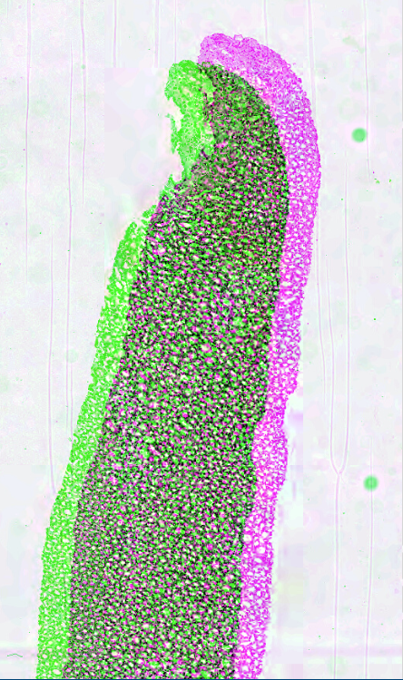
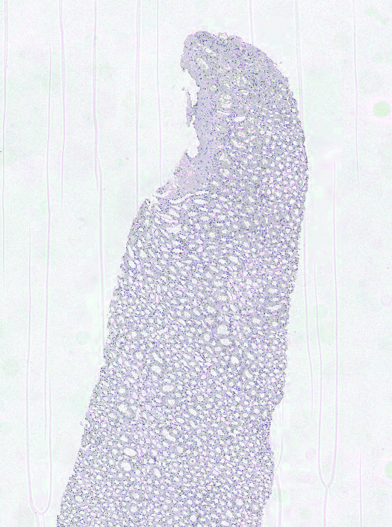

# Landmak based Image Registration with GDAL

This pipeline is a registration method based on thin plate spline transform that is a transformation originally used for aligning and reprojecting geographical images (maps) through georeferencing. This method can be applied to images that we have with different modalities of the same or adjacent tissue sections.
 
The method uses landmark (or reference) points annotated on an image pair. Unlike other transformation methods like rigid or affine that apply the transformation (see our [plugin](https://github.com/SarderLab/register-images)) at the global level to entire image, this method can benefit more from reference points. This can particularly be useful when there are deformations in tissue sections. Adding reference points in those areas would improve alignment of tissue sections at the local level.

## Installation

First, install the dependencies by running:

<pre> pip3 install -r requirements.txt </pre>

## Prepare Landmarks

For both fixed and moving images, prepare a `pandas` dataframe with corresponding landmakrs in both images. then run  `utils/create_annot.py` to create the json annotation files. Once the files are ready, add the paths of both images and corresponding landmarks in `gdal_test.py` function.

## Run the Pipeline

Run:

<pre> python3 gdal_test.py </pre>

This will same a `yaml` file contatining the transformation between the 2 images where the moving image being the `warp`. The overlaid images can be visialized in `HistomicsUI` in [Digital Slide Archive](https://athena.rc.ufl.edu/).

A sample Json file is shown below that can be vizualized in HistomicUI:
```
sources:
- path: fixed.tif
- path: moving.warp.tif
  position:
    s11: 0.9973672168782958
    s12: 0.0
    s21: 0.0
    s22: -0.9973672168782958
    x: -1625.0990222293258
    y: 15395.050096084185
  c: 1
```

The images can be vizualized in HistomicsUI:


| Before Registration         | Arrow | After Registration        |
|-----------------|-------|-----------------|
|  | →     |  |


